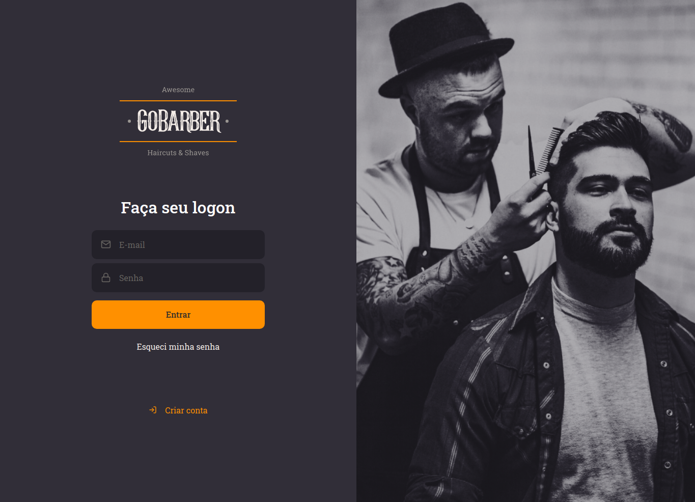
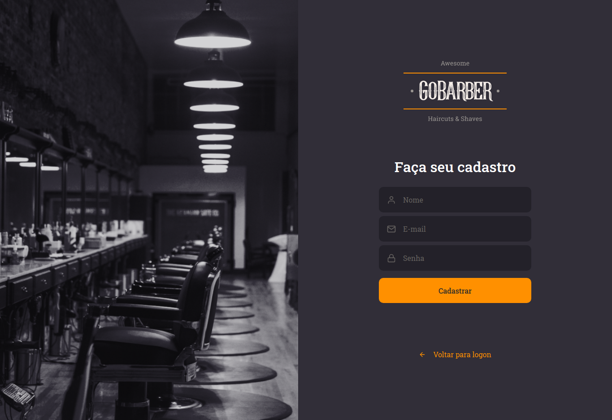
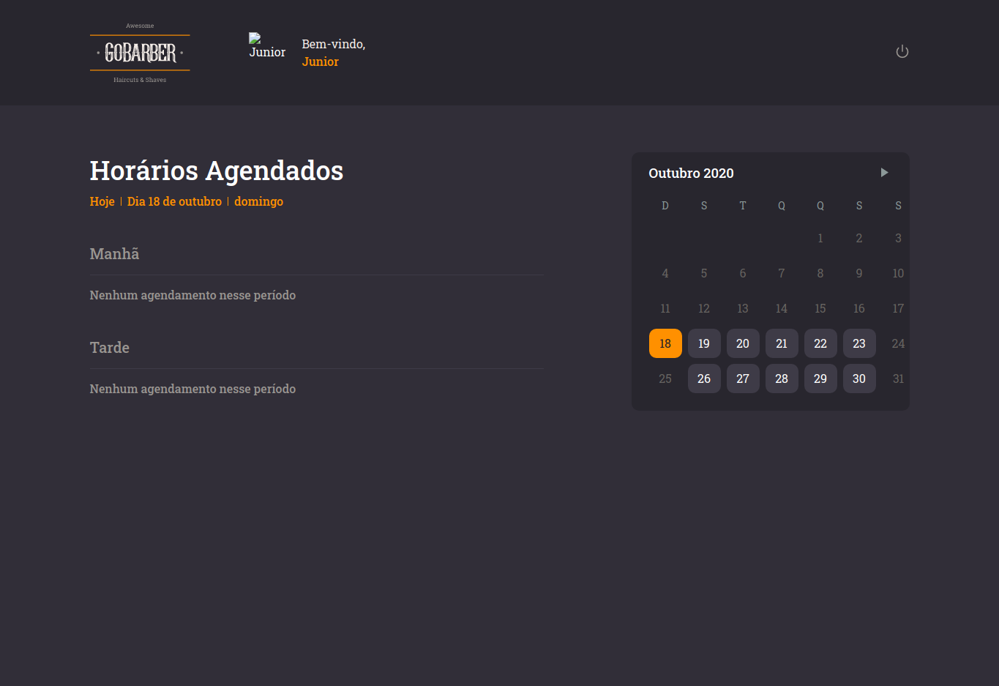

<h1 align="center">
 
Gobarber
</h1>

Web application made with react, which consists of an administrative panel for a barbershop service provider.

  

  
  
  

## Gobarber

The system consists of an administrative panel to manage a barber's schedules. You can browse between the days of the month and see what times are scheduled.

## API

For the correct functioning of this application it is necessary to connect the API, available [here](https://github.com/rubensojunior/gobarber-api)

## User Stories

- User can create a account
- User can login
- User can update profile
- User can update photo
- User can see all appointments by selected date

## Tests

- To run tests use `yarn test`
- To run coverage use  `yarn test:coverage`

## Como rodar

- Clone project
- run `yarn`
- run `yarn start`

## License

[LICENSE](https://opensource.org/licenses/MIT)

---

Created with passion by me 👨🏻‍💻
